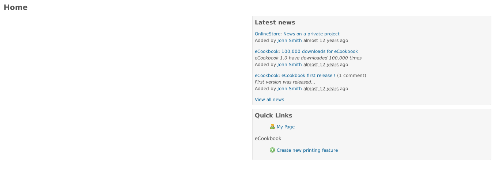
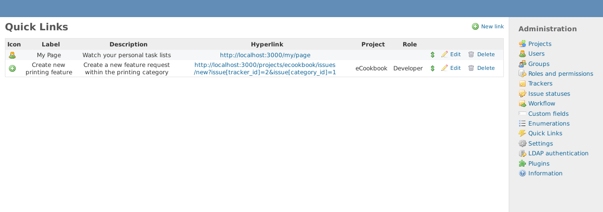

# Redmine Quick Links
A plugin for Redmine which adds quick links to the welcome page and project overview page.
It allows quick access to URLs not only for places inside Redmine but also for external sites.
For example you can use it to give your users a direct link to a prefilled issue form to file a new bug or create a todo.
Or you have a special project help page and your project members should be able to access it directly from the overview. One can restrict the access to links by project membership and roles so every user gets just the links he needs. 

## How it works
The Quick Links plugin adds a new view to Redmine's administration panel. On this view all your created links are listed and you can sort them to your needs. But keep in mind, if a link has project permissions set it's moved to its own section on the welcome page. You can also edit or delete existing links on this view. To create a new Link click on "New link" in the contexual menu section.

The form fields are:

- **Label** The text which is shown in quick link boxes.
- **Description** A descriptive text which is shown as tooltip.
- **URL** The specific URL (internal or external) the Link should point to.
- **Project** Select a project if the link should only visible to project members. If a project is selected the link is also shown on the projects overview page.
- **Role** Restrict the access to the link to a specific role. (e.g. special Gantt queries only for managers)
- **icon-class** If you would like to show an icon next to your link you can specify the CSS class here.

### Global links
By letting the Project and Role fields empty you can create links without project relations. These links are shown to every logged user and are only available on the welcome page.

### Prefilled issue form
This is not a plugin specific feature but a small hint to a nice Redmine feature. You can prefill your issue form by passing additional arguments to the URL. E.g to preselect a specific tracker id one can write the url like this `http://your.redmine.domain/projects/your-project/issues/new?issue[tracker_id]=2` so your users don't need to select the tracker when multiple options are available.

# How to install the plugin
The necessary steps are:
1. Clone the Github repository to your Redmine's plugin folder.
1. Execute a plugin migration with `bundle exec rake redmine:plugins:migrate RAILS_ENV=production`

 
